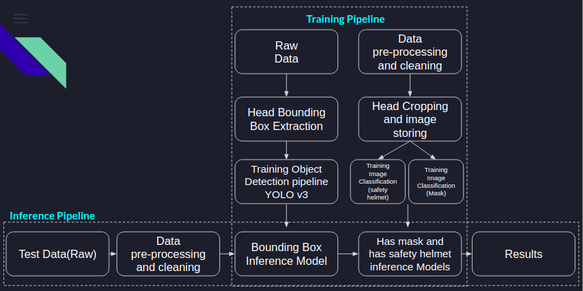

# AIM: To build an inference engine to predict whether a person is wearing a safety helmet and a face mask

##### Required Dependencies:

  - Numpy
  - Pandas
  - Matplotlib
  - Glob
  - OS
  - OpenCV and OpenCV contrib
  - Dataset and Model files: https://drive.google.com/drive/folders/1byVStCYq9vslkFilF3js_jEx4uMELW6F?usp=sharing
##### Frame Works:
  - Yolo v3 Darknet
  - Pytorch

##### Architectural Diagram:

### Instruction to run the code

Clone this repository and install the dependencies. Download .weights file, .pt files and images folder from the google drive inside this repository at <path-to-safety_helmet_and_mask_prediction-folder>
Step 1: Data Preprocess
```sh
cd <path-to-safety_helmet_and_mask_prediction-folder>
python3 data_preprocess.py
```
Step 2: Generating YOLO V3 compatible annotation files
```sh
python3 yolov3_ann.py
cp yolo_train_annotations/. images/
```
Step 3: Generating training dataset for Image classification pipeline
```sh
python3 image_cropping.py
```
Step 4: Training YOLO V3 to our custom dataset
  - Go to Google colab: https://colab.research.google.com/drive/1rZmr8-cVxzq6lirFksQBmw8ZSKvpImov?usp=sharing
  - Click on 'Runtime' option from the menubar and select 'Run all'
  - .weights file will be generatied as the training will proceed. You can either use this .weights file or the file which is provided on the google drive link in the dependencies section above for inference.


Step 5: Train Image classification pipeline:
```sh
python3 train_image_classification.py
```
"model_detail.pt" model file will be generated after running the above script or you can download the same from google drive link shared.

Step 6: YOLO V3 inference:
```sh
python3 yolo_inference.py
```
Step 7: Image Classification inference:
```sh
python3 image_cl_inference.py
```
Note: If you want to run only the inference pipeling follow the instructions from step 6 onwards.

#### Evaluation Metric
Evaluation metric for object detection pipeline is: Mean Average Precision (mAP)
Evaluation Metric for image classification pipeline: Classification Accuracy (acc1 and acc2 for safety helmet and mask detection respectively)
Combined Evaluation metric for whole pipeline can be defined as:
```
Evaluation Metric = (mAP*(acc1 + acc2))/2
```
##### Justification of choosing the above ecaluation metric:
The above evaluation metric score evaluate the whole pipeline and not in parts, i.e. when object detection model performs poorly i.e location of head not detected, it will affect the image classification also hence multiplying the mAP with accuracy value will give the combined effect of performance of both the models and hence make the performance of the classification model dependent on object detection model.

###### Some cases are studied as below:
case 1: when mAP=0, acc1=1, acc2=1
Evaluation Metric score = (0*(2))/2 = 0
hence if the object detection performs poorly i.e location of head not detected, then the performance of image classification does not matter. Overall score should be poor.

Similarly,
case 2: when mAP=1, acc1=0, acc2=1
Evaluation Metric score = (1*(0+1))/2 = 0.5 
That is location of head is detected but one of the image classification model does not perform well so the score is 50%.
